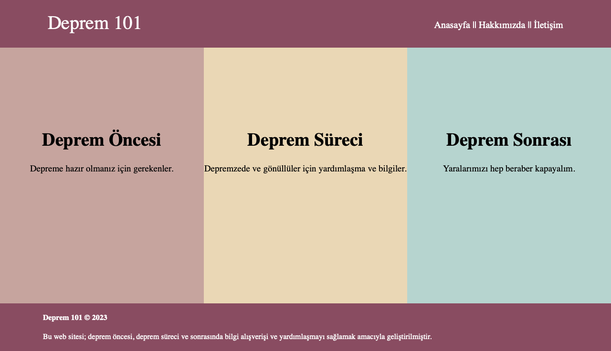

# Deprem 101

## Özet
>Deprem 101; insanların deprem konusunda her türlü içeriğe tek bir kaynaktan ulaşabilmesi için tasarlanmış bir platformdur. İçerikler deprem öncesi, süreci ve sonrası olarak üçe ayrılmıştır. Size uygun olan bilgiye en hızlı şekilde ulaşabilmeniz hedeflenmiştir.

## Problem
>Deprem konusundaki kaynakların internette dağınık bir şekilde yer alması ve gerektiğinde bulmanın zor olması. Ayrıca internette güvenilir olmayan kaynakların da bulunması. 

## Amaç
>* İnsanların deprem gerçekleşmeden önce gerekli önlemleri almasını sağlamak.
>* Deprem sürecinde depremzede ve gönüllülerin ihtiyacı olacak bilgilere ve sitelere ulaşmasını kolaylaştırmak.
>* Deprem sonrasında yaralarımızı hep beraber kapamak.

## Hedef Kitle
>Deprem gerçekleşmeden önce bilgilenmek isteyenler, deprem sürecinde depremzede ve gönüllüler, deprem sonrası desteğe ihtiyacı olan ve destekte bulunmak isteyenler.

***

***

## Deprem Öncesi
- Bilgilendirme Kaynakları
- Deprem Çantası
- Bina Dayanıklılık Testi
- Gönüllü Olma

***

## Deprem Süreci
- Depremzedeler için
  - Enkaz Bildirimi
  - Konaklama Yardımı
  - Mobil Tuvaletler
  - Sağlık Servisleri
  
&nbsp;

- Gönüllüler için
  - Bağış Yapma
  - Dijital Yardımlaşma
  - Konaklama Sağlama
  - Yardım Merkezleri

  ***

## Deprem Sonrası
- Psikolojik Destek
- Öğrenci Bursları
- Oyuncak ve Kitap Toplama
- Hayvan Dostlarımıza Yardım